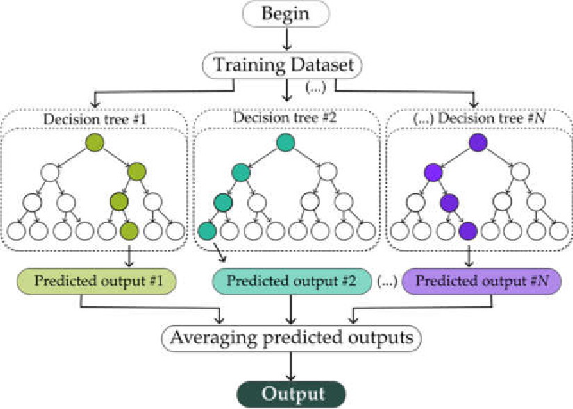

# Extra Trees Classifier

`Extra Trees Classifier` or **Extremely Randomized Trees** is a type of ensemble learning technique which aggregates the results of multiple de-correlated decision trees collected in a “forest” to output it’s final result. It was first introduced by Geurts et al. (2006). It's part of Scikit-Learn library in Python programming.

To each split in the data subset, it fits each decision tree on a random subset of the total data. This randomness and variance leads to a model that is robust and prone to overfiting.

This randomness actually adds some bias to the model, but due to averaging of several uncorrelated models, it reduces the variance and hence leads to better generalization.

Extra Trees differ from Random Forest in the way how they choose the split of each internal node.

For the Random Forest classifier, The best split is selected among all possible splits. However, Extra Trees induce further randomness: They select splits at random. This leads to even more variance in the model, leading to an overall reduction in the model bias.

## Advantages

1. **Handling Overfitting**: One advantage of Extra Trees Classifier over Random Forest is that it is less likely to overfit the training set.
2. **Speedy Training**: It can train multiple trees in parallel. Moreover, due to the randomness of the cut point selection, it is less computational expensive than Random Forest.
3. **Flexibility**: This model can also be useful for both regression and classification problems.

## Disadvantages

1. **Randomness**: There’s a high randomness due to randomized cut-points, which can lead to a less optimal decision boundary, hence less accurate model.
2. **High Variance**: Extra Trees Classifier models can have a high variance themselves, which can make the model sensitive to the specific data used for training.
3. **Less Interpretability**: The model is not easily interpretable, this is, you cannot understand how a prediction was made.

## When to use Extra Trees Classifier

Extra Trees Classifier can be used in various fields including healthcare and e-commerce. It is also commonly used in situations where predictive accuracy is more important than model interpretability.

If you have a complex dataset with a mixture of types and you’re in a hurry and don’t mind a bit of a “black box” solution, Extra Trees (or Random Forests) might be a good starting point. Extra Trees is also less sensitive to the specific hyper-parameters used, which makes it easier to use without tweaking parameters.

In conclusion, while the Extra Trees Classifier is powerful and can save computational time and resources, it is not always the most accurate model depending on your needs and your data set. It is best to understand and consider these factors when choosing which model to use.
