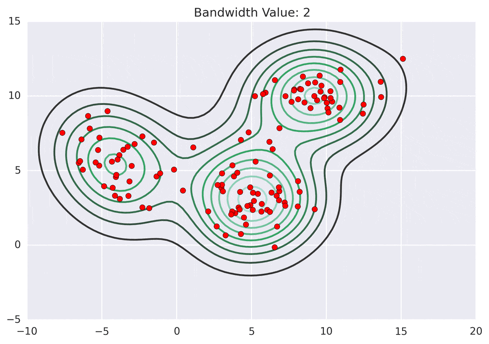

# Mean Shift Clustering

Mean Shift clustering is a versatile algorithm that aims to discover blobs in a smooth density of samples. It is a centroid-based algorithm, which works by updating candidates for centroids to be the mean of the points within a given region. These candidates are then filtered in a post-processing stage to eliminate near-duplicates to form the final set of centroids.

## Advantages of Mean Shift Clustering

1. **No Assumption of Cluster Shape**: Mean Shift does not assume any prior knowledge on the number of clusters or their shape, unlike K-means which assumes the clusters to be spherical.
2. **Robustness to Outliers**: The algorithm is not much affected by outliers since it takes the mean of points in a region.
3. **Versatility**: The bandwidth parameter can be adjusted to fine-tune the number of clusters.
4. **Only One Parameter to Set**: The bandwidth parameter is the only parameter that needs to be set manually.
5. **Applicability to Non-linear Clustering**: It can find non-linear clusters that other algorithms like K-means cannot find.

## Disadvantages of Mean Shift Clustering

1. **Computationally Expensive**: It can be slower than other clustering methods due to the computation of the mean for points within the window at each iteration.
2. **Bandwidth Selection**: Choosing the right bandwidth is crucial, and it can be difficult to find the optimal value.
3. **Not Scalable**: The algorithm can be inefficient for high-dimensional data or very large datasets.
4. **Ambiguity in Cluster Assignment**: Points equidistant to multiple cluster centers can be ambiguously assigned.

## Images to Explain Mean Shift Clustering



_The image above shows how Mean Shift clustering iteratively shifts points (in blue) towards the region of the highest density (in red) to find cluster centers._

## Sample Code

Here's a basic example of how to use Mean Shift clustering in Python with the `scikit-learn` library:

```python
import numpy as np
from sklearn.cluster import MeanShift
import matplotlib.pyplot as plt

# Sample data
X = np.array([[1, 2], [1.5, 1.8], [5, 8], [8, 8], [1, 0.6], [9, 11]])

# Mean Shift clustering
ms = MeanShift()
ms.fit(X)
labels = ms.labels_
cluster_centers = ms.cluster_centers_

# Plotting
plt.scatter(X[:, 0], X[:, 1], c=labels, marker="o")
plt.scatter(cluster_centers[:, 0], cluster_centers[:, 1], c='red', marker="x")
plt.title('Mean Shift Clustering')
plt.show()
```

## Scenarios to Use Mean Shift Clustering

Mean Shift clustering is particularly useful in scenarios where:

1. **The number of clusters is not known a priori**: Since Mean Shift does not require specifying the number of clusters, it is suitable for exploratory data analysis.
2. **Cluster shapes are irregular**: The algorithm can handle clusters of different shapes and sizes, unlike K-means which is limited to spherical clusters.
3. **Robust clustering is required**: In cases where the data might contain outliers, Mean Shift can provide a more robust clustering solution.
4. **Image processing tasks**: Mean Shift is popular in computer vision for tasks such as image segmentation and tracking due to its ability to handle spatial data and find clusters of pixels.

Remember, the performance and suitability of Mean Shift clustering will depend on the specific characteristics of the dataset and the computational resources available.
