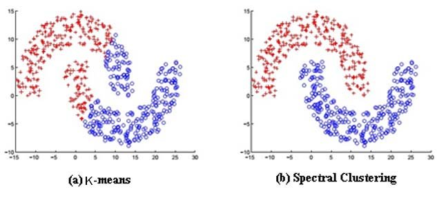

# Spectral Clustering

Spectral clustering is a technique in machine learning that is used to group data points into distinct clusters. It is based on the spectrum (eigenvalues) of the similarity matrix of the data. Spectral clustering has become quite popular due to its simplicity and its ability to cluster data that is not linearly separable.



## Advantages of Spectral Clustering

- **Flexibility in Cluster Shapes**: Unlike K-means, spectral clustering can find clusters with irregular boundaries, as it relies on the connectivity of the points rather than distance measures.

- **Similarity Measures**: It allows for the use of custom similarity measures, which can be tailored to the specific dataset or problem at hand.

- **Dimensionality Reduction**: Spectral clustering can be viewed as a dimensionality reduction technique, which can be useful for visualization and may improve the performance of other algorithms when used as a preprocessing step.

- **Global Information**: It uses the global information of the dataset, which often results in better performance compared to algorithms that use local information, like K-means.

## Disadvantages of Spectral Clustering

- **Scalability**: It can be computationally expensive for large datasets because it requires the eigen decomposition of the similarity matrix, which is a dense matrix of size `n x n` where `n` is the number of data points.

- **Sensitivity to Parameters**: The results can be quite sensitive to the choice of the similarity graph (e.g., the scale of the Gaussian kernel) and the number of clusters specified.

- **No Out-of-sample Extensions**: Unlike K-means, spectral clustering does not provide an explicit function to assign new points to existing clusters.

## Sample Code

Below is a sample Python code snippet that uses the `scikit-learn` library to perform spectral clustering:

```python
import numpy as np
from sklearn.cluster import SpectralClustering
import matplotlib.pyplot as plt

# Generate sample data
from sklearn.datasets import make_moons
X, y = make_moons(n_samples=200, noise=0.05, random_state=42)

# Apply Spectral Clustering
sc = SpectralClustering(n_clusters=2, affinity='nearest_neighbors')
labels = sc.fit_predict(X)

# Plotting the results
plt.scatter(X[labels == 0, 0], X[labels == 0, 1], s=50, marker='o', color='red')
plt.scatter(X[labels == 1, 0], X[labels == 1, 1], s=50, marker='s', color='blue')
plt.title("Spectral Clustering")
plt.show()
```

In this code, we generate a dataset with two interleaving half circles (a typical non-linearly separable dataset) and then apply spectral clustering to it. The resulting plot shows how spectral clustering manages to separate the two groups effectively.

## Scenarios for Using Spectral Clustering

Spectral clustering is particularly useful in scenarios where the data is not linearly separable and clusters have irregular shapes. Some common scenarios include:

- Image segmentation, where you want to group pixels that have similar colors or textures.
- Social network analysis, where you want to find communities based on the connection patterns between individuals.
- Any domain where the similarity between data points can be better expressed with a graph structure rather than Euclidean distances.
