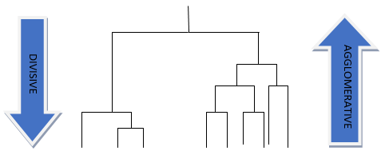

# Agglomerative Clustering

Agglomerative Clustering is a type of hierarchical clustering method that builds a hierarchy of clusters. This type of clustering makes use of the bottom-up approach where each data point starts in its own cluster and clusters are successively merged together.



_Image Source: DataCamp_

## Advantages of Agglomerative Clustering

1. **Ideal for utilizing non-flat geometry data**: Agglomerative clustering is efficient in handling non-elliptical shapes.
2. **You can visualize the data structure**: With Hierarchical clustering, you can visualize the grouping more effectively using Dendrograms.
3. **Greater flexibility**: It allows different distance metrics and different linkage criteria.

## Disadvantages of Agglomerative Clustering

1. **Can’t handle large datasets**: Like K-Means, Agglomerative Clustering also is not suitable for large datasets.
2. **Can’t undo the previous step**: Once the instances have been assigned to the clusters, moving them is not possible.

## Sample Code

Here is a simple implementation of Agglomerative Clustering using Sci-kit learn library in Python:

```python
from sklearn.cluster import AgglomerativeClustering
from sklearn.preprocessing import StandardScaler

# standardize data
scaler = StandardScaler()
data = scaler.fit_transform(data)

# Agglomerative clustering
model = AgglomerativeClustering(n_clusters=3, affinity='euclidean', linkage='ward')
model.fit(data)
labels = model.labels_
```

This code will calculate clusters of data array into 3 clusters with Euclidean distance measure.

## Use scenario

Agglomerative Clustering is used in wide variety of fields like:

1. **Organizing Business Hierarchies**: Businesses can group their resources and perform heirarchical level data analysis.
2. **Sentence Clustering in NLP**: In Natural Language Processing, we often need to represent meaning of sentences/ paragraphs in a collection. Using use agglomerative clustering, you can group similar sentences together.
3. **Classification of Returned Queries**: In search engines, returned queries need to be grouped into different categories. This can be achieved using agglomerative clustering.
