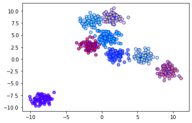

# BIRCH (Balanced Iterative Reducing and Clustering using Hierarchies) Cluster

BIRCH is a very efficient clustering algorithm when having to deal with large datasets.



## Advantages of BIRCH algorithm:

1. **Livestream data clustering:** A BIRCH clustering algorithm can process data in a single run, without any need to keep the entirety of the data in memory.

2. **Memory Management:** The BIRCH algorithm uses its CF-Tree structure to store summary information and discards the exact details of the dataset, making it much more memory efficient than other clustering algorithms such as K-means or DBSCAN.

3. **Outliers handling:** BIRCH can iteratively eliminate outliers and refine the clusters, making it robust in the presence of noise and outliers.

## Disadvantages of BIRCH algorithm:

1. **Distance Metric:** BIRCH algorithm only uses Euclidean distance and does not support other distance metrics, which makes this algorithm less flexible.

2. **High-dimensional data:** BIRCH algorithm does not perform well on high-dimensional data.

3. **Lack of density representation:** Unlike DBSCAN, BIRCH algorithm does not represent density in their clusters,which can be problematic in some scenarios.

## Sample Code

Here is a snippet of Python code showing how the BIRCH algorithm can be implemented using Sklearn library.

```python
from sklearn.cluster import Birch
from sklearn.datasets import make_blobs

# generate sample data
X, y = make_blobs(n_samples=1000, centers=5, cluster_std=0.6, random_state=0)
birch_model = Birch(branching_factor=50, n_clusters=None, threshold=1.5)

# train model
birch_model.fit(X)

# predict clusters
predictions = birch_model.predict(X)
```

## Scenario When to Use BIRCH

Because of its memory efficiency and ability to handle large amounts of data, BIRCH is best suited for large datasets where the instances have many attributes. It's also an optimal choice when the data is continuously incoming, as BIRCH can incrementally process the data without requiring the whole dataset to be stored in memory.
